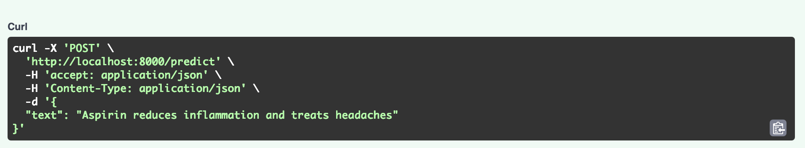
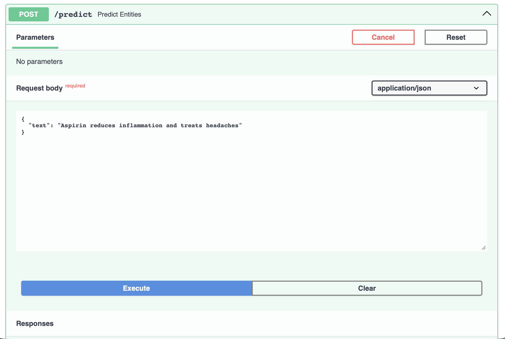
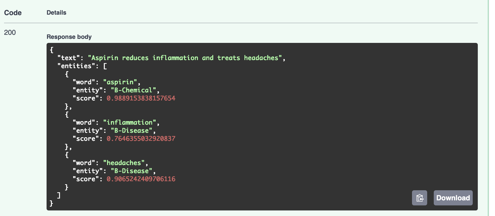

# Chemical/Disease Named Entity Recognition (NER) API

A production-ready REST API for biomedical Named Entity Recognition (NER) using a fine-tuned BERT model with LoRA (Low-Rank Adaptation).

## Overview

This project deploys a BERT-based NER model for identifying:
- **Chemicals** (e.g., Aspirin, Ibuprofen)
- **Diseases** (e.g., diabetes, headaches)

The model is fine-tuned using LoRA for efficient training and deployment. 

## Features

- FastAPI-based REST API
- Interactive API documentation (Swagger UI)
- Containerized for easy deployment
- LoRA fine-tuned BERT model
- Trained on BC5CDR biomedical dataset

## Model Performance

- **Base Model:** BERT-base-uncased
- **Fine-tuning Method:** LoRA (r=8, alpha=16)
- **Training Dataset:** BC5CDR (BioCreative V Chemical Disease Relation)
- **Task:** Named Entity Recognition 

## Tech Stack

- **Framework:** FastAPI
- **ML Libraries:** PyTorch, Transformers, PEFT
- **Deployment:** Docker, Docker Compose
- **Model:** BERT with LoRA adapters

## Installation

### Prerequisites

- Docker and Docker Compose
- OR Python 3.10+

### Option 1: Docker (Recommended)

```bash
# Clone the repository
git clone https://github.com/YOUR_USERNAME/chemical_disease_ner_api.git
cd chemical_disease_ner_api

# Build and run
docker-compose up --build
```

### Option 2: Local Setup

```bash
# Clone the repository
git clone https://github.com/YOUR_USERNAME/chemical_disease_ner_api.git
cd chemical_disease_ner_api

# Install dependencies
pip install -r requirements.txt

# Run the API
python app.py
```

## Usage

### Interactive API Documentation

Once running, visit: `http://localhost:8000/docs`

### Python Example

```python
import requests

response = requests.post(
    "http://localhost:8000/predict",
    json={"text": "Aspirin is used to treat headaches"}
)

result = response.json()
print(result)
```

### cURL Example



## API Endpoints

| Endpoint | Method | Description |
|----------|--------|-------------|
| `/` | GET | Root endpoint (API info) |
| `/health` | GET | Health check |
| `/predict` | POST | Single text prediction |
| `/batch_predict` | POST | Batch predictions |
| `/docs` | GET | Interactive API docs |

## Project Structure

```
ner-project
├── app.py                 
├── requirements.txt       
├── Dockerfile            
├── docker-compose.yml    
├── notebooks/
│   └── finetune_bert.ipynb 
└── README.md             
```
## Configuration

Key parameters in `app.py`:
- `num_labels`: 5 (O, B-Chemical, I-Chemical, B-Disease, I-Disease)
- `max_length`: 512 tokens
- `device`: Auto-detected (CPU/GPU)

## Model Training

The model was trained using:
- **Dataset:** BC5CDR (tner/bc5cdr from Hugging Face)
- **Base Model:** google-bert/bert-base-uncased
- **Method:** LoRA fine-tuning
- **Framework:** Hugging Face Transformers + PEFT

See the training notebook in `notebooks/` for details.

## Deployment

### Local

```bash
docker-compose up
```

## Known Limitations

- Model currently detects only Chemicals and Diseases
- Maximum input length: 128 tokens

## License

MIT License - see LICENSE file for details

## Example Results

```
Input:
{
"text":  "Aspirin reduces inflammation and treats headaches"
}

```




